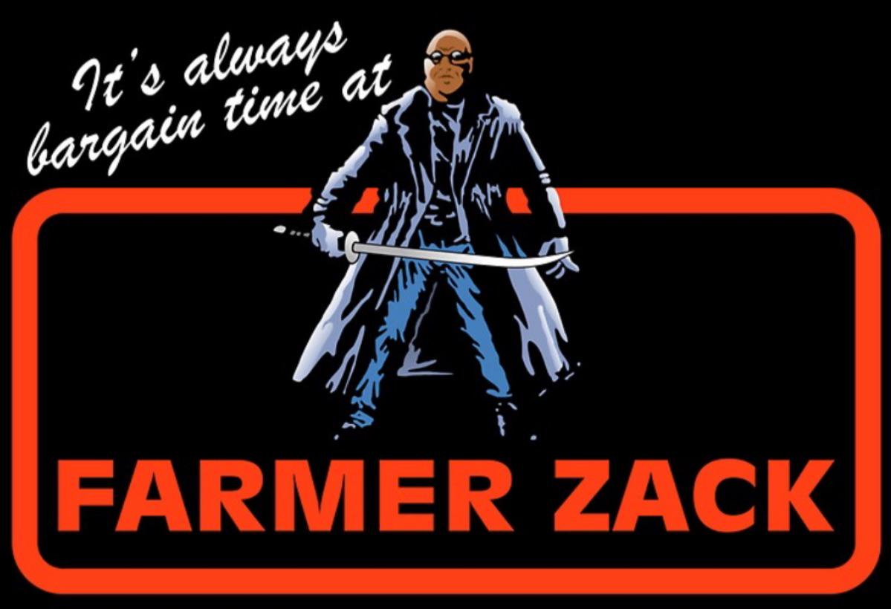

# Farmer Zack Grocery Store Case Study

The **Farmer Zack Sales Dashboard** project is a data pipeline and analytics case study designed to generate, process, and upload dummy grocery store data to Google BigQuery and visualize the data in Looker Studio. 

## Background and Design

**Farmer Zack** is a reference to Detroiters Season 2 Episode 5. https://www.imdb.com/title/tt7692336/. The color design may be jarring, and an accessibility nightmare for anyone with red/green color blindness, but Farmer Zack insisted that the color scheme fit in with his edgy new rebrand.

## Features

- **Data Generation**: Creates realistic dummy data for stores, products, foot traffic, and transactions.
- **BigQuery Integration**: Uploads the generated data to Google BigQuery tables for further analysis.
- **Environment Configuration**: Uses a `.env` file to manage sensitive credentials and project settings.
- **Data Cleaning**: Clears existing data in BigQuery tables before uploading new data.
- **Customizable**: Easily modify the data generation logic to suit specific use cases.

## Requirements

- Python 3.8 or higher
- Google Cloud SDK
- Google BigQuery Python Client Library
- Pandas
- dotenv

## BigQuery Tables and Views

### Tables
- `stores`: Contains store IDs and locations.
- `products`: Contains product details such as name and category.
- `foot_traffic`: Contains daily visitor counts for each store.
- `transactions`: Contains transaction details, including product, quantity, and price.

### Views
- `transaction_details`: an aggregated view of transactions joined with store and product details
- `transaction_summaries`: a daily aggregated summary of transactions by store with visitor counts included
